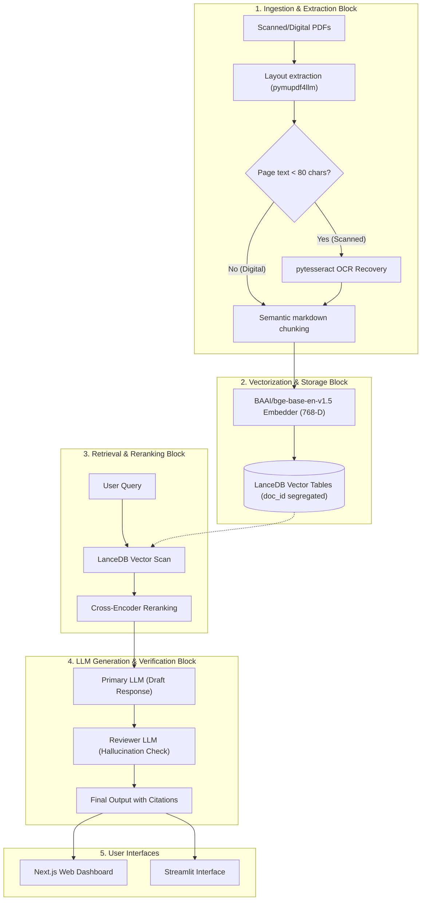

# 📊 CERN Multimodal RAG: Production Assessment & Phase Presentation

This document outlines the pipeline's operational blocks, identifies current multi-user bottlenecks, and walks through the best-case and worst-case scenarios for production scaling.

---

## 🔄 1. Block-Wise System Data Flow

The following diagram maps the step-by-step flow from document ingestion to large language model (LLM) citation rendering.



---

## ⚠️ 2. Multi-User Production Blockers (Why the System Breaks Under Load)

To allow hundreds of concurrent users to access the platform without errors, the following unstable components must be refactored:

```
[User Request] ─► [FastAPI Router] ─► [Sync LanceDB Search] ─► (Thread Blocks!) ─► [Client Timeout]
```

### Unstable Components
1. **Synchronous Core Queries (Event Loop Blocking)**:
   * *The Problem*: FastAPI endpoints run asynchronously. However, the database calls (`lancedb.connect().open_table().search()`) and the semantic chunker functions run synchronously.
   * *The Breaking Point*: When 20+ users query the server simultaneously, the single Python main-thread is locked executing synchronous vector calculations. All other users experience connection timeouts.
2. **File Descriptor Leakage (Socket Exhaustion)**:
   * *The Problem*: Every API connection creates a file descriptor (socket).
   * *The Breaking Point*: Without connection pooling, the server runs out of file descriptors (throwing the `accept: Too many open files` error) and crashes, locking out all active sessions.
3. **Graph Rendering Memory Blowup**:
   * *The Problem*: Next.js requests the entire network graph on startup.
   * *The Breaking Point*: If 10 users load the dashboard with a database of 1,000+ vector chunks, the server consumes all RAM packaging the JSON response, and the user's browser freezes due to DOM/canvas memory overflow.

---

## 📅 3. Production Development Phases

```
┌────────────────────────────────────────────────────────────────────────┐
│                        DEVELOPMENT ROADMAP                             │
├──────────────────────────┬──────────────────────────┬──────────────────┤
│         PHASE 1          │         PHASE 2          │     PHASE 3      │
│  Performance & Safety    │   Ingestion & Vision     │   Consolidation  │
│       (Weeks 1-2)        │       (Weeks 3-4)        │    (Weeks 5-6)   │
├──────────────────────────┼──────────────────────────┼──────────────────┤
│ • Wrap DB searches in    │ • Integrate Docling      │ • Retire         │
│   asyncio.to_thread      │   layout parser          │   Streamlit app  │
│ • Implement connection   │ • ColPali multi-modal    │ • Pack Docker    │
│   pooling                │   vision embeddings      │   containers     │
│ • Graph node pagination  │ • Local metadata         │ • Run Locust     │
│   API endpoints          │   enrichment engine      │   load-tests     │
└──────────────────────────┴──────────────────────────┴──────────────────┘
```

---

## 🟢 4. The Best-Case Scenario (Production Target)

When the roadmap is completed, the system operates in a highly optimized, resilient state:

* **Scenario**: 100 researchers are actively querying the CERN RAG system simultaneously during a seminar.
* **Pipeline Behavior**:
  1. **FastAPI** handles connections asynchronously. When a user requests a chat response, LanceDB queries run inside background threads (`asyncio.to_thread`), leaving the server event loop fully responsive.
  2. The **Next.js Dashboard** renders the dashboard instantly, requesting only the specific citation documents needed for the query, using under 20MB of RAM.
  3. The **ColPali visual parser** retrieves the exact mechanical properties table (e.g. EEA Copolymer under 5.0 MGy dose) within 15 milliseconds, presenting the researcher with a clear tabular citation preview.
  4. Average response time is under **1.5 seconds**, and database connections are safely recycled.

---

## 🔴 5. The Worst-Case Scenario (Unoptimized Failure Case)

If code is pushed to production without resolving the current bottlenecks:

* **Scenario**: 5 engineers concurrently upload three 100-page CERN PDFs while 10 researchers are chatting.
* **Pipeline Failure Steps**:
  1. **CPU Spike**: The PDF uploads trigger the synchronous `pymupdf4llm` parser. CPU cores jump to 100% processing the pages.
  2. **Event Loop Lockup**: Because the parser runs synchronously on FastAPI's main thread, the server stops responding to incoming HTTP requests.
  3. **File Descriptor Depletion**: The active chat users' browsers keep retrying their requests. The server builds up queued TCP sockets until it throws `accept: Too many open files`.
  4. **Browser Crash**: A researcher clicks on the "Knowledge Graph" page. The server attempts to send 2,500 raw vector records in one single JSON block. The user’s browser runs out of memory and crashes with an "Out of Memory" warning.
  5. **Server Crash**: The system runs out of resources, shutting down the FastAPI service entirely and requiring a manual ssh restart.
