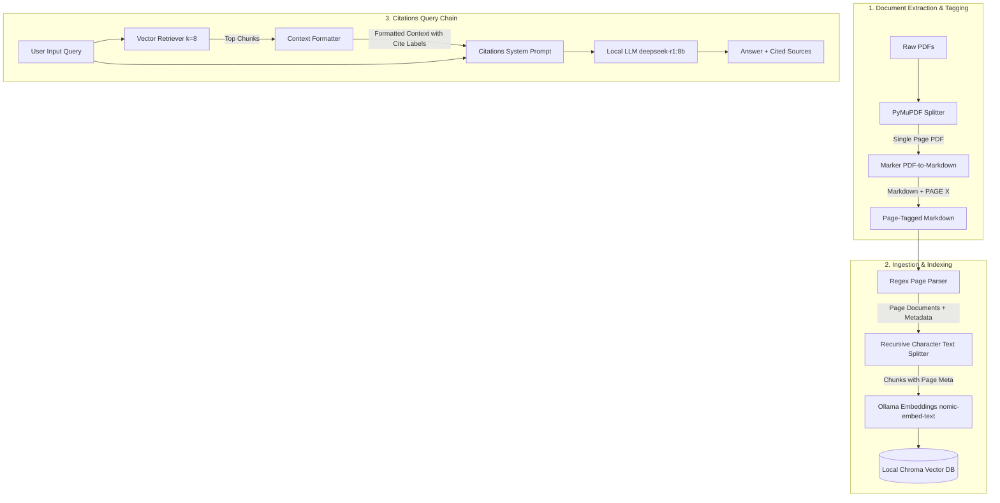

# Local Page-Level RAG Architecture & Replication Guide

This guide explains the methodology, component design, and workflows utilized in this project so you can easily replicate this architecture for your own applications.

---

## 1. Architectural View (Application Perspective)

Standard RAG architectures often lose track of page-level boundaries during document chunking. This makes it impossible to provide accurate page-level citations (e.g., *"This figure is discussed on page 14 of Report A"*). 

This project solves that by preserving page boundaries during the PDF extraction phase and maintaining page numbers as metadata keys throughout chunking, indexing, retrieval, and generation.



---

## 2. Key Components & Implementation Steps

### Step 1: Page-Aware PDF-to-Markdown Extraction
To preserve page numbers, the PDF is split into single-page PDFs dynamically using **PyMuPDF (`fitz`)**. Each single-page PDF is converted to markdown using **`marker`**. We then join them back together, inserting a clear page boundary token (`=== PAGE X ===`).

* **Why this is done**: Converting an entire multi-page PDF directly often breaks layout structures or aggregates pages in a way that makes identifying exact page numbers difficult.
* **Code Pattern to Copy**:
```python
import fitz
import tempfile
import os
from marker.converters.pdf import PdfConverter
from marker.models import create_model_dict
from marker.output import text_from_rendered

def extract_pdf_with_pages(pdf_path, output_md_path):
    doc = fitz.open(pdf_path)
    converter = PdfConverter(artifact_dict=create_model_dict())
    all_pages = []

    for page_num in range(len(doc)):
        # Extract single page as temporary PDF
        single_page_pdf = fitz.open()
        single_page_pdf.insert_pdf(doc, from_page=page_num, to_page=page_num)
        
        with tempfile.NamedTemporaryFile(suffix=".pdf", delete=False) as tmp:
            tmp_path = tmp.name
            single_page_pdf.save(tmp_path)
            single_page_pdf.close()

        try:
            # Convert single page
            rendered = converter(tmp_path)
            text, _, _ = text_from_rendered(rendered)
            
            # Format and inject page delimiter
            all_pages.append(f"\n\n=== PAGE {page_num + 1} ===\n\n" + text.strip())
        finally:
            os.unlink(tmp_path)

    doc.close()
    
    # Save merged markdown
    with open(output_md_path, "w", encoding="utf-8") as f:
        f.write("".join(all_pages))
```

---

### Step 2: Page-Level Ingestion & Chunking
When importing the extracted markdown files, we split the text based on the `=== PAGE X ===` markers. Each page becomes a distinct parent document, inheriting the page number in its metadata dictionary before character splitting.

* **Why this is done**: If we split the entire file without page awareness, chunks would span across pages, muddying citations. By splitting per-page, every text chunk is strictly bound to its actual source page.
* **Code Pattern to Copy**:
```python
import re
from pathlib import Path
from langchain_core.documents import Document
from langchain_text_splitters import RecursiveCharacterTextSplitter
from langchain_chroma import Chroma
from langchain_ollama import OllamaEmbeddings

def parse_pages(text: str, filename: str):
    pattern = r"=== PAGE (\d+) ==="
    parts = re.split(pattern, text)
    documents = []
    
    # parts[0] is header/empty. We loop through matched pairs: (page_num, content)
    for i in range(1, len(parts), 2):
        if i + 1 < len(parts):
            page_num = int(parts[i])
            page_content = parts[i + 1].strip()
            
            if len(page_content) > 50:  # Avoid indexing blank pages
                documents.append(Document(
                    page_content=page_content,
                    metadata={"filename": filename, "page": page_num}
                ))
    return documents

# Chunking & Embedding
def ingest_documents(md_path, db_directory):
    with open(md_path, "r", encoding="utf-8") as f:
        text = f.read()

    pages = parse_pages(text, Path(md_path).name)
    
    splitter = RecursiveCharacterTextSplitter(
        chunk_size=1200, 
        chunk_overlap=150
    )
    chunks = splitter.split_documents(pages)

    vectorstore = Chroma(
        collection_name="my_rag_collection",
        embedding_function=OllamaEmbeddings(model="nomic-embed-text"),
        persist_directory=db_directory
    )
    vectorstore.add_documents(chunks)
```

---

### Step 3: Retrieval & LLM Citation Prompting
When a user queries the application:
1. The system fetches the top $K$ relevant chunks from Chroma DB.
2. The context is formatted to prefix each chunk with its source citation label (e.g., `[report.pdf - Page 12]`).
3. The LLM is given strict system instructions to rely on the context, reference the citations when stating facts, and distinguish what it knows from general knowledge.

* **Why this is done**: LLMs excel at in-context learning. By structuring the prompt with clear document metadata labels, the model can synthesize accurate citations directly in the response text.
* **Code Pattern to Copy**:
```python
from langchain_chroma import Chroma
from langchain_ollama import OllamaEmbeddings, ChatOllama
from langchain_core.prompts import ChatPromptTemplate
from langchain_core.runnables import RunnablePassthrough
from langchain_core.output_parsers import StrOutputParser

# 1. Format the chunks with their metadata labels
def format_docs(docs):
    formatted = []
    for doc in docs:
        filename = doc.metadata.get("filename", "Unknown")
        page = doc.metadata.get("page", "?")
        formatted.append(f"[{filename} - Page {page}]\n{doc.page_content}")
    return "\n\n".join(formatted)

# 2. Setup DB and Chain
vectorstore = Chroma(
    collection_name="my_rag_collection",
    embedding_function=OllamaEmbeddings(model="nomic-embed-text"),
    persist_directory="./chroma_db"
)
retriever = vectorstore.as_retriever(search_kwargs={"k": 8})
llm = ChatOllama(model="deepseek-r1:8b", temperature=0.4)

prompt = ChatPromptTemplate.from_template("""
You are an expert technical assistant.

**Rules:**
- Answer the user's question using the retrieved context.
- When stating specific facts or data points, cite the source filename and page number from the context headers.
- You can use general knowledge for explanation, but clearly distinguish it from context facts.

Context:
{context}

Question: {question}
""")

rag_chain = (
    {"context": retriever | format_docs, "question": RunnablePassthrough()}
    | prompt
    | llm
    | StrOutputParser()
)
```

---

## 3. Technology Stack Choice & Rationale

| Layer | Technology Used | Rationale / Benefit |
| :--- | :--- | :--- |
| **PDF Extraction** | `fitz` (PyMuPDF) + `marker` | `marker` extracts tables, formulas, and headers into clean Markdown better than simple layout-agnostic text strippers. `fitz` handles fast page splitting. |
| **Orchestration** | `LangChain` | Provides easy chaining of retrieval steps, formatting pipelines, and LLM interfaces out-of-the-box. |
| **Vector Database** | `Chroma DB` | Zero configuration needed, runs entirely locally, and persists data to a local directory. |
| **Embeddings Model** | `nomic-embed-text` (Ollama) | Local embedding model with a large context window (8k), offering high retrieval performance on technical texts. |
| **Language Model** | `deepseek-r1:8b` (Ollama) | DeepSeek-R1 utilizes a reasoning structure (thinking chain) which produces highly accurate technical analysis and strict compliance with prompt constraints (such as source citation rules). |

---

## 4. Key Advantages of copying this Methodology

1. **Local and Air-Gapped**: The entire project runs on local hardware via Ollama. It does not send any files, queries, or intellectual property to external cloud servers (like OpenAI or Anthropic).
2. **True Citation Capability**: By preserving page tags through extraction to ingestion, the LLM outputs exact page coordinates, which is a key requirement for highly regulated scientific and technical compliance workloads.
3. **High-Accuracy Formatting**: Using Markdown representation (`marker`) retains the semantic structure of tables and headers, which helps the character splitter segment text along logical paragraphs.
