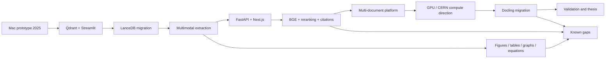

# Obsidian Graph View

Open this folder in Obsidian and enable the Graph view. The `[[wikilinks]]` in
these notes create the main connected cluster without modifying the existing
archive.

## Suggested graph workflow

1. Open [[00-MASTER-MAP]].
2. Follow the timeline nodes first.
3. Open the architecture note to connect implementation decisions to dates.
4. Use the evidence map while drafting each chapter.
5. Use the gaps note as an interview questionnaire for your own memory and supervisor validation.

The graph is intentionally evidence-oriented: each thesis claim should connect
to a source folder, an implementation artifact, or a question awaiting proof.
